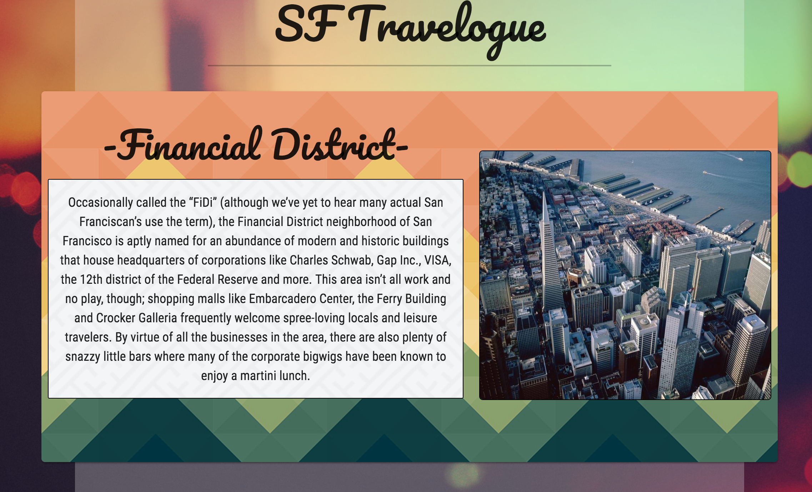

# [SF-Travelogue] (https://sf-travelogue.herokuapp.com/)
SF-Travelogue allows users to search for interesting places in San Francisco neighborhoods.

## Motivation
The motivation for this project is to allow newcomers to San Francisco to have an easy way to explore the neighborhoods and for residents to discover new, interesting places in the city.

## Technologies

* Materialize
* Node.js
* Express
* MongoDB
* Mongoose
* jQuery

## RESTful Routes(Endpoints)

SF-Travelogue API provides the following JSON endpoints:
* ```GET /api ``` Describes all available endpoints
* ```GET /api/neighborhoods``` get all neighborhoods as JSON
* ```GET /api/neighborhoods/:hoodId``` get one specific neighborhood as JSON
* ```GET /api/neighborhoods/:hoodId/places``` get all places from a neighborhood
* ```GET /api/neighborhoods/:hoodId/places/:placeId``` get one specific place from a neighborhood
* ```POST /api/neighborhoods/:hoodId/places``` create a new place for a neighborhood
* ```PUT /api/neighborhoods/:hoodId/places/:placeId``` Updates one place attributes
* ```PATCH /api/neighborhoods/:hoodId/places/:placeId``` Updates one place attributes (research?)
* ```DELETE /api/neighborhoods/:hoodId/places/:placeId``` Delete one specific place from a neighborhood

## Code We Are Proud Of

```
<div class="center-align">
  <a href="https://www.google.com/maps/dir/here/{{this.address}}+San+Francisco,+CA" target="_blank" class="waves-effect waves-light btn-large" id="googleMaps"><i class="material-icons left">navigation</i>Directions</a>
</div>
```
```
function editPlaceSuccess(data){
  $('#newPlaceForm input').val('');

  allNeighborhoods.forEach(function(neighborhood){
    if(neighborhood._id === neighborhoodId){
      neighborhood.places.forEach(function (place, i){
        if(place._id === placeToUpdateId){
          neighborhood.places.splice(i,1,data);
        }
      });
    }
  });

  renderSpecificNeighborhood();
}
```
##Screen Shots




## Ideas for future upgrade

* more flexibility navigating through the neighborhoods
* more intuitive to now that clicking the neighborhood card will open another page
* integrate the Google map with the page
* possibility to add place images
